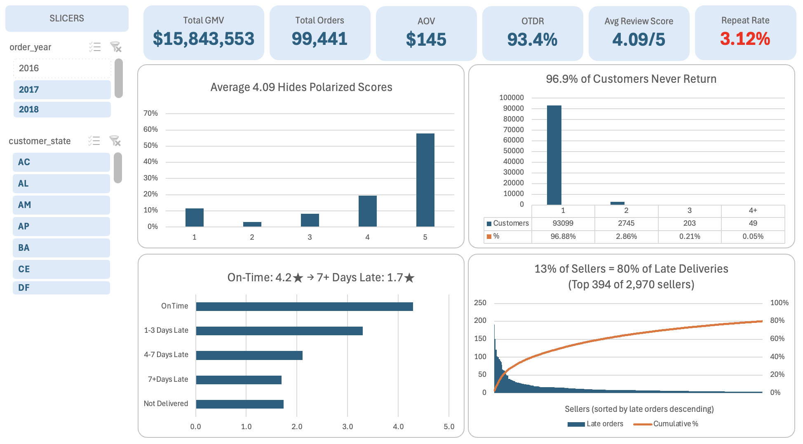
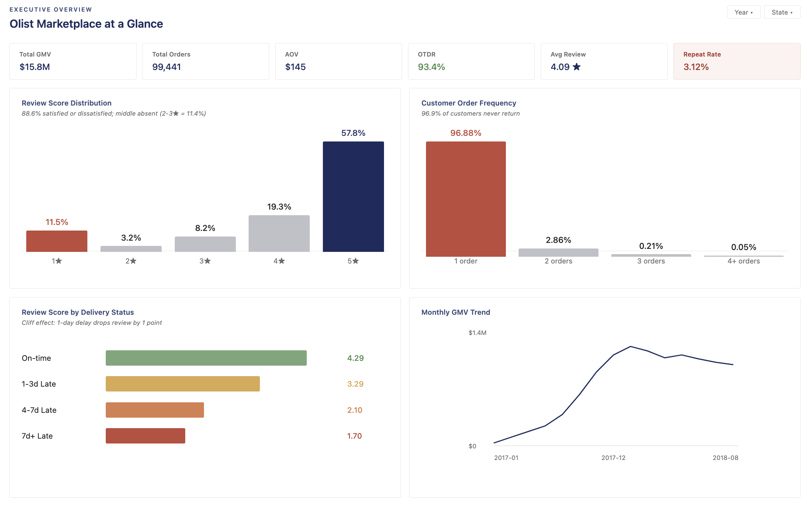
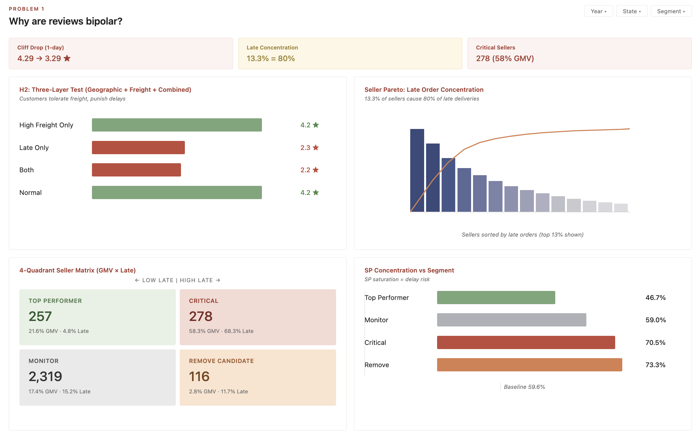
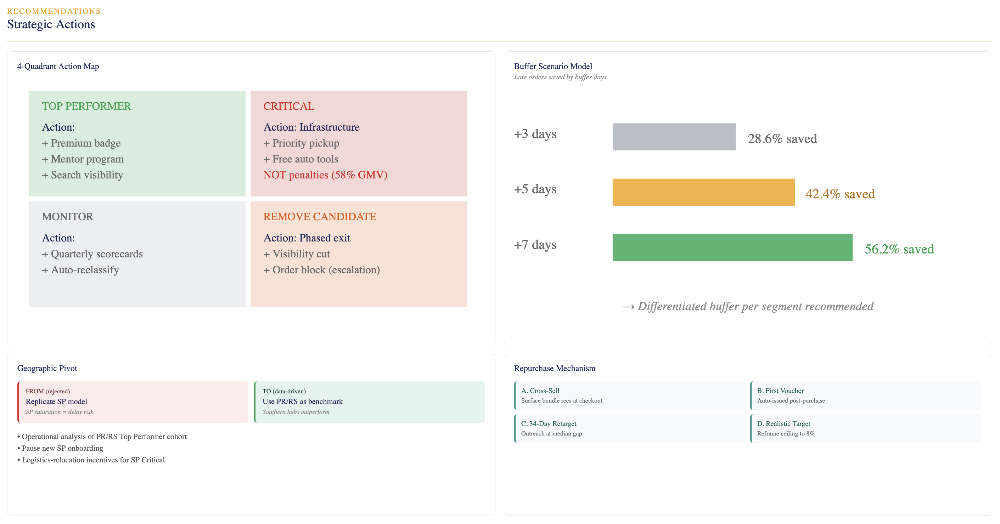

# Olist E-commerce Analysis

**Two Problems, Two Different Solutions**

Shipping delays cause review scores to collapse, while a structurally low repurchase rate reveals Olist as a transactional pipeline rather than a retention platform. Each problem requires a distinct strategic intervention.

Full Analysis File: [Olist_Analysis.xlsx](https://github.com/yaeryung-lee/Data-Analysis/releases/tag/v1.0)

---

## Dashboard Previews

### Excel Ad-hoc Analysis Dashboard

### Power BI Dashboards

---

## Analytical Framework

Both problems follow the same 5-step process but produce independent conclusions:

**EDA** (profile 9 tables, identify anomalies) → **Hypothesis Tree** (branch each problem into testable causes) → **Statistical Testing** (ANOVA, Chi-square, Pareto) → **Sub-Analysis** (drill into validated hypotheses) → **Strategic Action** (differentiated, logic-based recommendations)

---

## Problem 1: Review Bipolarity

### EDA Finding
88.6% of all reviews are either satisfied or highly dissatisfied; middle scores are rare. 
Bipolarity implies a binary cause: something either works or fails dramatically. The question is which operational dimension creates that split.

### Hypothesis Tree

Six potential drivers were identified from EDA and tested individually.

| # | Hypothesis | Method | Result |
|---|---|---|---|
| H1 | Geographic imbalance & freight cost | 3-layer test (state, freight, combined) | REJECTED |
| H2 | Missing product info | Count check: only 1.85% of products | REJECTED |
| H3 | Payment failures | Structurally excluded from delivered orders | REJECTED |
| H4 | Product vs. service dissatisfaction | Logistics issues account for over 50% of 1-star reviews (Not Received + Missing + Late = 54.2%) | ACCEPTED |
| H5 | Delivery delay | ANOVA: significant threshold effect | **VALIDATED** |

### Rejected Hypothesis Deep-Dive: H1 — Geographic Imbalance & Freight Cost

Sellers don't exist in 4 of 27 states, while customers exist in every state. Long-distance shipping to remote states could inflate freight costs and delivery times, ultimately driving review drops.

This hypothesis was tested through three layers of analysis, each building on the last:

**Layer 1 — Geographic distribution × review:** Average review scores across all 27 states cluster between 3.6 and 4.2, despite the uneven seller distribution. States with no local sellers (AL, RR) show slightly lower reviews but not at a level explaining bipolarity.

| State | Seller % | Avg Delivery Days | Avg Review |
|---|---|---|---|
| AL | 0.00% | 24.0 | 3.8 |
| SP | 4.43% | 8.3 | 4.2 |
| PR | 6.92% | 11.5 | 4.2 |
| RR | 0.00% | 29.0 | 3.6 |
| All states | — | 12.1 | 4.1 |

*Result: No effect. Geographic distribution alone does not explain review drops.*

**Layer 2 — Freight burden × review:** Orders grouped into freight cost bands (High >50%, Mid 25-50%, Low <25% of order value) all show identical 4.1 average review scores across 98,666 orders.

| Freight Band | Avg Review | Total Orders |
|---|---|---|
| High (>50%) | 4.1 | 15,742 |
| Mid (25-50%) | 4.1 | 28,179 |
| Low (<25%) | 4.1 | 54,745 |

*Result: No effect. Freight cost alone does not depress reviews.*

**Layer 3 — Combined freight + delay effect (key finding):** Cross-tabulating freight burden with delivery delay status isolated the real driver:

| Group | Avg Review | Orders |
|---|---|---|
| High Freight Only | 4.2 | 14,650 |
| Late Only | 2.3 | 5,442 |
| Both (Freight + Late) | 2.2 | 1,092 |
| Normal | 4.2 | 77,474 |

Reviews collapse only when delay is present regardless of freight cost. "High Freight Only" orders score 4.2 (normal), while "Late Only" drops to 2.3. Adding high freight to a late order barely changes the score (2.2 vs 2.3). Customers tolerate expensive shipping; they punish broken delivery promises.

This rejection became the bridge to H6. Rather than a dead-end null result, the three-layer test isolated delivery delay as the operative variable, naturally directing the analysis toward H6.

### Validated Hypothesis: H6 — Delivery Delay Causes Review Collapse

**Test:** ANOVA comparing review scores across four delivery timing groups.

| Group | Count | Average Review |
|---|---|---|
| On-time | 89,949 | 4.29 |
| 1-3 Days Late | 1,856 | 3.29 |
| 4-7 Days Late | 1,756 | 2.10 |
| 7+ Days Late | 2,798 | 1.70 |

**Result:** Statistically significant differences across all groups, confirming a threshold effect. The initial 1-3 day delay triggers the sharpest drop (1.0 point), with progressively smaller additional declines as delay lengthens. This pattern strengthens the correlated interpretation.

Pearson correlation between delivery days and review score was weak (r = -0.30), which would have suggested a minor relationship. ANOVA on grouped data revealed the actual shape: a non-linear threshold effect rather than a smooth gradient. Linear regression alone would have missed this. Delivery delay operates as a binary trust event; the strategy must prevent delays from happening, not just minimize their length.

### Deeper Analysis: Seller Pareto

Before recommending a delivery buffer, tested whether delays are platform-wide or concentrated among specific sellers.

**Result:** 13.3% of sellers (394 out of 2,970) generate 80% of all late deliveries. This is tighter than the standard 80/20 Pareto, meaning seller-targeted intervention is highly viable. An unconditional buffer policy would over-correct for the 87% of sellers already performing well.

### Cross-Analysis: GMV × Late Orders (4-Quadrant Seller Matrix)

To determine the right intervention per seller type, intersected top-GMV sellers (top 18%, n=535) with top-delay sellers (top 13%, n=394).

| Segment | Sellers | Seller % | GMV % | Late % | Avg late_rate | Avg Review |
|---|---|---|---|---|---|---|
| Critical (GMV↑/Late↑) | 278 | 9.4% | 58.2% | 68.3% | 9.50% | 3.98 |
| Top Performer (GMV↑/Late↓) | 257 | 8.7% | 21.6% | 4.8% | 4.83% | 4.10 |
| Remove Candidate (GMV↓/Late↑) | 116 | 3.9% | 2.8% | 11.7% | 29.49% | 3.74 |
| Monitor (GMV↓/Late↓) | 2,319 | 78.1% | 17.4% | 15.2% | 7.08% | 4.10 |

### Sub-Hypothesis: Volume Effect vs. Quality Issue

The 4-quadrant matrix raised a critical question: are the 278 Critical sellers genuinely problematic, or just high-volume?

Average late_rate analysis resolved this:

- **Critical sellers** (avg late_rate 9.50%) operate near the platform average (7.08%). Their high absolute late count reflects order volume, not poor performance. These sellers need infrastructure support, not penalties — their exit would risk 58% of platform GMV.
- **Remove Candidates** (avg late_rate 29.49%) are the actual quality problem. One in four orders arrives late, yet they contribute only 2.8% of GMV. Safe to restrict aggressively with minimal platform cost.

This distinction matters: applying strict SLAs to Critical sellers would risk losing the platform's revenue backbone. The true quality intervention target is the Remove Candidate segment.

### Geographic Distribution 

**Initial assumption:** SP (Sao Paulo), with the densest seller population and best infrastructure, would represent the optimal logistics model.

**Actual finding:** SP concentration correlates with delay risk, not operational excellence.

| Segment | SP Share | vs. Baseline (59.6%) |
|---|---|---|
| Top Performer | 46.7% | -12.9pp |
| Monitor | 59.0% | -0.6pp |
| Critical | 70.5% | +10.9pp |
| Remove Candidate | 73.3% | +13.7pp |

Top Performers cluster in southern states — PR (Parana) at 17.5% vs 11.3% baseline, and RS (Rio Grande do Sul) at 6.6% vs 4.2% baseline. Mid-sized southern logistics hubs outperform the oversaturated SP market. Density may create congestion, not efficiency.

**Strategic reversal:** Earlier analysis recommended "replicate SP's logistics model." This finding flips that recommendation; PR/RS should be the operational benchmark for nationwide scaling.

---

## Problem 2: Low Repurchase Rate (3.12%)

### EDA Finding
96.88% of customers buy once and never return. The 3.12% repurchase rate falls far below marketplace industry benchmarks of 20-30%.

97% non-return is too universal to blame on individual service failures. If even a fraction of dissatisfaction caused exit, we would see 70-80% retention failure, not 97%. This reframe drove the analysis toward structural causes over satisfaction-based explanations.

### Hypothesis Tree

| # | Hypothesis | Method | Result |
|---|---|---|---|
| H1 | Low review scores cause non-return | Chi-square | REJECTED |
| H2 | Delivery delays cause non-return | Chi-square | REJECTED |
| H3 | Durable categories have lower repeat rates | Pivot comparison | REJECTED |
| H4 | Olist is structurally a transactional pipeline | Multi-test validation | **VALIDATED** |

### Rejected Hypotheses

**H1 — Satisfaction does not predict retention.** Chi-square test of `review_score × is_repeat` showed no significant association. Even customers giving 5-star reviews failed to return at meaningful rates. Satisfaction and retention are decoupled on this platform.

**H2 — Operational excellence does not equal retention.** Despite an on-time delivery rate of 93.4%, on-time delivery did not predict repurchase. Chi-square test of `delivery_status × is_repeat` showed no significant association. Operational quality, while critical for review scores (Problem 1), does not translate to retention.

**H3 — Category isn't the variable.** Predicted that durable goods (longer replacement cycles) would show lower repeat rates than consumables. Result was opposite of expectation:

| Category Type | Order Share | Repeat Rate |
|---|---|---|
| Durable | 53.07% | 7.88% (highest) |
| Consumable | 22.86% | 6.88% |
| Other | 22.64% | 6.60% |

The narrow spread (1.3pp range) confirms the repeat problem cuts across all categories and is structural, not category-specific.

### Validated Hypothesis: H4 — Olist is a Transactional Pipeline

Three pieces of evidence converge on the same structural conclusion:

- **Evidence 1:** 90% of customers purchase a single item and exit (verified by pivot table on basket size).
- **Evidence 2:** Voucher-using customers show significantly higher repeat rates (chi-square validated, significant association).
- **Evidence 3:** Multi-item buyers show significantly higher repeat rates (chi-square validated, significant association).

**Interpretation:** Repurchase only occurs when triggered by external incentives (vouchers) or initial multi-item purchase behavior. Natural return motivation is absent at the platform level. Review satisfaction and on-time delivery fail to produce retention here. This is not an operational problem but a platform-identity problem.

---

## Strategic Recommendations

### Recommendation #1: Tiered Seller Management

Four segments require four distinct policies.

**Critical** (278 sellers / 58.3% GMV / 68.3% Late) — Volume-driven absolute delays with near-average late_rate (9.50%). **Action:** infrastructure support — priority carrier pickup slots, consolidated shipping options, free automated labeling tools. Strict SLAs would risk losing 58% of platform GMV.

**Top Performer** (257 sellers / 21.6% GMV / 4.8% Late) — Best-practice operators with lowest late_rate (4.83%) and highest reviews (4.10). Strong southern (PR/RS) representation. **Action:** benchmark extraction — operational interviews, "Verified Premium Seller" badges with search visibility advantage, mentor seller assignments for Critical sellers.

**Remove Candidate** (116 sellers / 2.8% GMV / 11.7% Late) — Triple risk: late rate 29.49% (3.6x platform average), reviews 3.74 (lowest), minimal GMV. **Action:** phased visibility restriction with monitoring of late rate trends. Escalate to order blocking if performance fails to improve.

**Monitor** (2,319 sellers / 17.4% GMV) — Standard performance within normal ranges. **Action:** quarterly automated scorecards. Reclassify to Critical or Remove Candidate if thresholds are breached.

### Recommendation #2: Geographic Strategy Pivot

Reverse the prior recommendation to "replicate SP model." Segment analysis revealed SP concentration correlates with delays; 73% of Remove Candidates and 70% of Critical sellers are in SP.

**Actions:** conduct operational analysis of PR/RS Top Performer cohort; pause new SP seller onboarding and expand southern seller acquisition; offer logistics-relocation incentives for selected SP Critical sellers.

### Recommendation #3: Differentiated Delivery Buffer

Apply tiered buffers by segment rather than a uniform platform-wide buffer.

| Segment | Buffer | Rationale |
|---|---|---|
| Critical | Minimal buffer | Normal late_rate; absorb volume effect |
| Top Performer | No buffer | Preserve competitive promised dates |
| Remove Candidate | Extended buffer (interim) | Temporary protection during phased exit |
| Monitor | Standard buffer | Default application |

**Expected impact:** reduction in late orders while preserving customer-facing promised date competitiveness.

### Recommendation #4: Repurchase Mechanism Redesign

Acknowledge structural ceiling — focus only on validated triggers.

**A. Mandatory Cross-Sell:** Surface category-relevant recommendations at every single-item checkout. Use bundle incentives to lift basket size. Directly attacks the 90% single-item exit pattern.

**B. First-Order Voucher:** Auto-issued shortly after first purchase with limited expiry. Category-restricted to learn customer preference and trigger second visit.

**C. 34-Day Retargeting:** Automated outreach at the median repurchase gap window. Curated based on first-purchase category.

**D. Realistic Target:** Reframe success metrics to reflect the platform's structural ceiling. Operational improvements alone cannot match marketplace benchmarks. The repeat rate goal should reflect what is achievable within a transactional pipeline model.

### Priority Matrix

| Priority | Recommendation | Effort | Impact |
|---|---|---|---|
| P0 | #1-C: Remove Candidate phase-out | Low | High |
| P0 | #3: Differentiated buffer | Low | High |
| P1 | #1-A: Critical infrastructure support | High | Very High |
| P1 | #4-A/B: Mandatory cross-sell + voucher | Medium | Medium |
| P2 | #2: PR/RS geographic pivot | High | Medium |
| P2 | #1-B: Top Performer playbook | Medium | Medium |

---

## Statistical Test Summary

| Hypothesis | Method | Result |
|---|---|---|
| Delivery delay → review drop | ANOVA (4-group) | Validated: threshold effect confirmed across On-time / 1-3d / 4-7d / 7d+ groups |
| Geographic/freight → review drop | 3-layer crosstabulation | Rejected: delay isolated as sole driver |
| Top 13% sellers cause 80% of delays | Pareto Analysis | Validated: 394 / 2,970 sellers |
| Review score ↔ repurchase | Chi-square | No association |
| On-time delivery ↔ repurchase | Chi-square | No association |
| Voucher use ↔ repurchase | Chi-square | Positive association |
| Multi-item purchase ↔ repurchase | Chi-square | Positive association |
| Category type ↔ repeat rate | Proportion comparison | Durable highest (opposite of expectation); spread only 1.3pp |

---

## Limitations

- **GMV is not Olist revenue.** Olist's commission rate is unknown. GMV is used as a proxy for platform impact.
- **Correlation is not causation.** ANOVA confirms a threshold effect between delivery delay and review scores, but cannot establish a full causal chain.
- **No marketing cost data.** CAC is unknown, so voucher campaign ROI cannot be precisely estimated.
- **Cohort retention analysis was not performed.** The 3.12% repeat rate is too low for cohort matrices to produce meaningful patterns.

---

## Tools, Skills, Frameworks

- **Excel & Power BI:** Power Query, Power Pivot, DAX, Star Schema, Dashboard Design
- **Statistical Methods:** ANOVA, Chi-square, Pareto Analysis
- **Frameworks:** Prioritization Matrix, 4-Quadrant Strategic Matrix
- **Data Source:** Olist Brazilian E-commerce Dataset — 9 tables, 100K+ orders, Sept 2016 - Oct 2018
